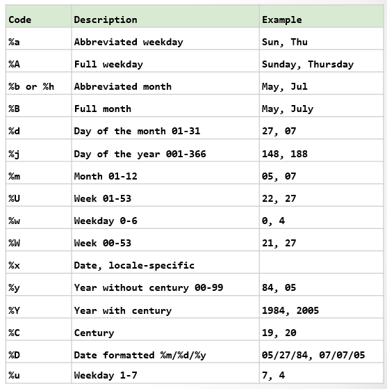

```{r echo=F, results='hide', message=FALSE, warning=FALSE}
# Installation, setup & formatting. Do not modify this code chunk.  
rm(list=ls(all=T))
knitr::opts_chunk$set(comment = NA)
knitr::opts_knit$set(global.par = TRUE)
par(cex=0.8); options(scipen=20, digits=4, width=90)
z = Sys.setlocale("LC_TIME", "C")

if(!require(devtools)) install.packages("devtools")
if(!require(pacman)) install.packages("pacman")
if(!require(dplyr)) install.packages("dplyr")
if(!require(ggplot2)) install.packages("ggplot2")
if(!require(tidyr)) install.packages("tidyr")
if(!require(stringr)) install.packages("stringr")
pacman::p_load(dplyr,ggplot2,tidyr,stringr)
```
<br><hr>

犯罪是一個國際關注的問題，但它在不同的國家以不同的方式記錄和處理。 在美國，聯邦調查局（FBI）記錄了暴力犯罪和財產犯罪。 此外，每個城市都記錄了犯罪行為，一些城市發布了有關犯罪率的數據。 伊利諾伊州芝加哥市從2001年開始在線發布犯罪數據。 芝加哥是美國人口第三多的城市，人口超過270萬。 在這個作業裡面，我們將關注一種特定類型的財產犯罪，稱為「汽車盜竊」， 我們將使用R中的一些基本數據分析來了解芝加哥的汽車盜竊紀錄。 請載入文件“data/mvtWeek1.csv”。

🌻 以下是各欄位的定義：

+ `ID`: 事件ID
+ `Date`: 日期與時間
+ `LocationDescription`: 失竊地點
+ `Arrest`: 是否破案
+ `Domestic`: 是否為家庭犯罪
+ `Beat`: 小區代碼
+ `District`: 區碼
+ `CommunityArea`: 社區代碼
+ `Year`: 年分
+ `Latitude`: 緯度
+ `Longitude`: 經度


🌻 藉由分析這些紀錄，我們可以：

+ 了解「汽車盜竊」事件的整體狀況和趨勢
+ 描述「汽車盜竊」事件在時、空間之中的分佈狀況
+ 做為警力配置的參考


🌻 這個練習的學習重點是：

+ 字串和日期(時間)資料的轉換
+ 練習使用分類計數和分類統計功能 `table` and `tapply`


<br>

- - -

###  Section-1 Loading the Data

Read the data into a data frame `D`. 
```{r}
D = read.csv("data/mvtWeek1.csv")
```
As I said, the names of your major data frame is the shorter the better. 

【1.1】How many rows of data (observations) are in this dataset?
```{r}
nrow(D)
#191641
```

【1.2】How many variables are in this dataset?
```{r}
ncol(D)
#11
```

Let's also check the data types of these variables 
```{r}
str(D)
#$ ID                 : int
#$ Date               : chr  
#$ LocationDescription: chr  
#$ Arrest             : logi 
#$ Domestic           : logi 
#$ Beat               : int 
#$ District           : int 
#$ CommunityArea      : int  
#$ Year               : int  
#$ Latitude           : num  
#$ Longitude          : num  
```

and do a quick summary on them.
```{r}
summary(D)
```


【1.3】Using the "max" function, what is the maximum value of the variable `ID`?
```{r}
max(D$ID)
```


【1.4】 What is the minimum value of the variable `Beat`?
```{r}
min(D$Beat)
```


【1.5】 How many observations have value TRUE in the `Arrest` variable (this is the number of crimes for which an arrest was made)?
```{r}
sum(D$Arrest)
```

What is the average arrest rate of car thief events?
```{r}
mean(D$Arrest)
```

【1.6】 How many observations have a `LocationDescription` value of `ALLEY`?
```{r}
sum(D['LocationDescription']=='ALLEY')
```
<br><br>


### Section-2 Processing Date and Time in R

【2.1】 In what format are the entries in the variable Date?

+ Month/Day/Year Hour:Minute
+ Day/Month/Year Hour:Minute
+ Hour:Minute Month/Day/Year
+ Hour:Minute Day/Month/Year

```{r}
head(D$Date)  # Month/Day/Year Hour:Minute
```

🌞 Date and Time are quite troublesome. Naturally the time line is a rational linear dimension. However, these nice real-number properties are all messed up in human society. Months have different days. Week may span over two months. The worst is, people record date and time in so many different formats that computers cannot read them automatically. Therefore, dates and time are usually read in as character strings. We have to manually look into the strings, recognize the format and then convert them into `Date` or `POSIXct` (name of a standard timing system) data types before we can properly using them in our programs. For an example, we need to observe the format in `D$date` and convert this `chr` column into a `POSIXct` vector (`ts`). 

```{r}
ts = as.POSIXct(D$Date, format="%m/%d/%y %H:%M")

#日期函式 as.Date() 可以將文字型式的日歷日期 (calendar date) 轉換成 {R} 的 日期類別(**Dates class) 物件.
#日期函式 strptime() 可以將文字型式的日歷時間轉換成 {R} 的 日期-時間類別物件''
#日期函式 `as.POSIXlt()` 與 `as.POSIXct()` 可以將日期-時間類別物件’’ 分別轉換成 POSIXlt, POSIXct類別格式.
#日期函式format()可以將 {R} 的 ``日期-時間類別物件'' 轉換成一般人可讀的文字型式的日期, 日, 星期, 月, 與時間.

#POSIXct: 非常大的正整數, 通常儲存在data.frame中使用
#POSIXlt: 是一個列表物件 (list), 分別儲存 星期中的第幾天, 一年中的第幾天, 月份, 月中的第幾天等等. 

#{R} 的日期時間的內設有些複雜, 因此 {R} 有些專門日期時間套件
#例如tidyverse套件系統提供lubridate套件, 或更完整的財務金融Rmetrics` 套件, 這些套件可以在處裡時間上變得較為方便.

```

🌻 `as.POSIXct(x, format)` converts a string vector `x` into a `POSIXct` vector.<br> 

🌷 Watch how format of the time string is specified in Date and Time Codes (see Table-1 below)    

{height=400}<br>
Table-1 Date and Time Formatting Codes

Now we can make histograms of this time variable (`ts`) in the same way as we do for numerics ...
```{r fig.height=2.5, fig.width=6.8}
par(mfrow=c(1,2), mar=c(4,3,3,1), cex=0.7)
hist(ts,"year",las=2,freq=T,xlab="",main="Event Counts in Years")
hist(ts,"quarter",las=2,freq=T,xlab="",main="Event Counts in Quartera")
```
<br><br>

🌻 `format()` can convert date/times back to strings in the desirable format

For examples, if we want to count the car thief events by weekdays ... 
```{r}
table( format(ts,'%w') )
```

by hours ...
```{r}
table( format(ts,'%H') )
```

by 7 days and 24 hours ...
```{r}
table(weekday=format(ts,'%u'), month=format(ts,'%H'))
```

With a few more line of codes we can transform the table into a heatmap that illustrates the time distribution of car thief events nicely. The plotting function will be elaborated latter in this course  
```{r fig.height=2.5, fig.width=6.8}
table(format(ts,"%u"), format(ts,"%H")) %>% 
  as.data.frame() %>% setNames(c("weekday","hour","count")) %>% 
  ggplot(aes(hour,weekday,fill=count)) +   #fill:上色
  geom_tile() + coord_fixed(ratio=1) +     #tile:熱圖、coord:小方框
  scale_fill_gradientn(colors=c("seagreen","yellow","darkred"))
  #可帶n種顏色
```

<br><p class="wwl">
<span style="font-size:16px">💡 Hints:</span>
The most useful functions in R are ...<br>
&emsp; ■ `table()`<br>
&emsp; ■ `tapply()`<br>
incorporating with ...<br>
&emsp; ■ `sort()`, `head()`, `tail()`<br>
&emsp; ■ `sum()`, `mean`, `max()`, `min`<br>
You should be able to solve all fo the questions below<br>
</p class="wwl"><br>

【2.2】 What is the month and year of the **median** date in our dataset? 
```{r}
format(median((ts)),'%m')
format(median((ts)),'%Y')
```

【2.3】 In which month did the fewest motor vehicle thefts occur?
```{r}
min(table(format(ts,'%m')))
x=(table(format(ts,'%m')))
x
names(x)[x==min(x)]
```

【2.4】 On which weekday did the most motor vehicle thefts occur?
```{r}
table(format(ts,'%u'))
y = table(format(ts,'%u'))
names(y)[y==max(y)]
```

【2.5】 Which month has the largest number of motor vehicle thefts for which an arrest was made?
```{r}
max(table(format(ts,'%m'),D$Arrest)[,2])
z = table(format(ts,'%m'),D$Arrest)[,2]
names(z)[z==max(z)]

table( format(ts[D$Arrest %in% TRUE],'%m'))

```
<br><br>


### Section-3 Visualizing Crime Trends

【3.1】 In general ... 

+ does it look like crime increases or decreases from 2002 - 2012? 
+ does it look like crime increases or decreases from 2005 - 2008? 
+ does it look like crime increases or decreases from 2009 - 2011?
```{r}
par(mfrow=c(2,2), mar=c(4,3,3,1), cex=0.7)

# 2002年到2012年逐年的犯罪數
subset(ts, format(ts, '%Y') >= 2002 & format(ts, '%Y') <= 2012) %>%
  hist("year",las=2,freq=T,xlab="",main="Event Counts in 2002 ~ 2012")
# 逐年減少，但在2010年和2011年有回升的趨勢

# 2005年到2008年逐年的犯罪數
subset(ts, format(ts, '%Y') >= 2005 & format(ts, '%Y') <= 2008) %>%
  hist("year",las=2,freq=T,xlab="",main="Event Counts in 2005 ~ 2008")
# 逐年下降的趨勢

# 2009年到2011年逐年的犯罪數
subset(ts, format(ts, '%Y') >= 2009 & format(ts, '%Y') <= 2011) %>%
  hist("year",las=2,freq=T,xlab="",main="Event Counts in 2009 ~ 2011")
# 逐年提升的趨勢，可能跟金融風暴有關
```

【3.2】 Does it look like there were more crimes for which arrests were made in the first half of the time period or the second half of the time period?
```{r}
# 在前半時段還是後半時段破案數較多
table(format(subset(ts, D$Arrest == T), '%Y') >= 2007)
table(format(subset(ts, D$Arrest == T), '%Y') >= 2006)
table(format(subset(ts, D$Arrest == T), '%Y'))
# 前半時段破案數較多
```

【3.3】 For what proportion of motor vehicle thefts in 2001 was an arrest made?
```{r}
prop.table(table(D$Arrest,format(ts,'%Y')),2)
v = table(D$Arrest,format(ts,'%Y')) %>% prop.table(2)
v
v['TRUE','2001']
```

【3.4】 For what proportion of motor vehicle thefts in 2007 was an arrest made?
```{r}
# 2007年的事件破案率
tapply(D$Arrest, format(ts, '%Y'), mean)["2007"]
```

【3.5】 For what proportion of motor vehicle thefts in 2012 was an arrest made?
```{r}
# 2012年的事件破案率
tapply(D$Arrest, format(ts, '%Y'), mean)["2012"]
tapply(D$Arrest, format(ts, '%Y'), mean)
```

<br><br>


### Section-4 Popular Locations

【4.1】 Which locations are the top five locations for motor vehicle thefts, excluding the "Other" category? You should select 5 of the following options.

```{r}
subset(D, D$LocationDescription != "OTHER", c("LocationDescription")) %>%
  table() %>% sort() %>% tail(5) %>% names()

n = tail(sort(table(subset(D,D$LocationDescription!='OTHER', c("LocationDescription")))),5)

class(n)
n
names(n)

#subset(D, D$LocationDescription != "OTHER")
```

【4.2】 How many observations are in Top5?
```{r}
# 前五名事件發生的地點總共發生幾件
subset(D, D$LocationDescription != "OTHER", c("LocationDescription")) %>%
  table() %>% sort() %>% tail(5) %>% sum()

sum(n)

```

【4.3】 One of the locations has a much higher arrest rate than the other locations. Which is it? 
```{r}
# 破案率最高的案發地點
tapply(D$Arrest, D$LocationDescription, mean) %>% sort() %>% tail(1) %>% names()
```

【4.4】 On which day of the week do the most motor vehicle thefts at gas stations happen?
```{r}
# 星期幾發生在加油站的事件最多
subset(ts, D$LocationDescription == "GAS STATION") %>% format('%u') %>% table() %>% 
  sort() %>% tail(1) %>% names()
```

【4.5】 On which day of the week do the fewest motor vehicle thefts in residential driveways happen?
```{r}
# 星期幾發生在住宅車道的事件最少
subset(ts, D$LocationDescription == "DRIVEWAY - RESIDENTIAL") %>% format('%u') %>% table() %>% 
  sort() %>% head(1) %>% names()
```

<br><br>

<center>
{height=80}

##### NINJA's DOJO ● ● ●
</center>

```{r fig.height=5.5}
L6 = table(D$Loc) %>% sort %>% tail() 
D %>% mutate(ts = ts) %>% 
  filter(LocationDescription %in% names(L6)[-4]) %>% 
  mutate(Loc = str_remove(LocationDescription, " .*$")) %>% 
  group_by(Loc, wday=format(ts,"%u"), hour=format(ts,"%H")) %>% 
  summarise(no.events = n(), arrest.rate = mean(Arrest), .groups="drop") %>% 
  group_by(Loc) %>% mutate_at(vars(no.events,arrest.rate), scale) %>% 
  gather("key","value",4:5) %>% 
  ggplot(aes(x=hour, y=wday,fill=value)) + geom_tile(alpha=0.75) +
  scale_fill_gradientn(colors=c("darkgreen","green","yellow","red","darkred")) +
  coord_fixed(ratio=1) + facet_grid(Loc~key) + theme_bw() +
  theme(axis.ticks=element_blank(),axis.text=element_text(size=6)) +
  ggtitle("Vehical Crimes in a Week")
```

<br><p class="wwl">
<span style="font-size:18px">`r "\U1F4A1"` 策略意涵：</span><br>
&emsp; ♞ 如果你是警方，你要如何配置警力？<br>
&emsp; ♞ 那如果你是小偷呢？<br>
</p class="wwl"><br>

🌷 光是使用`table()`和`tapply()`和資料視覺化，
我們就已經可以從資料中找到許多有策略意涵的資訊了。

<br><br>