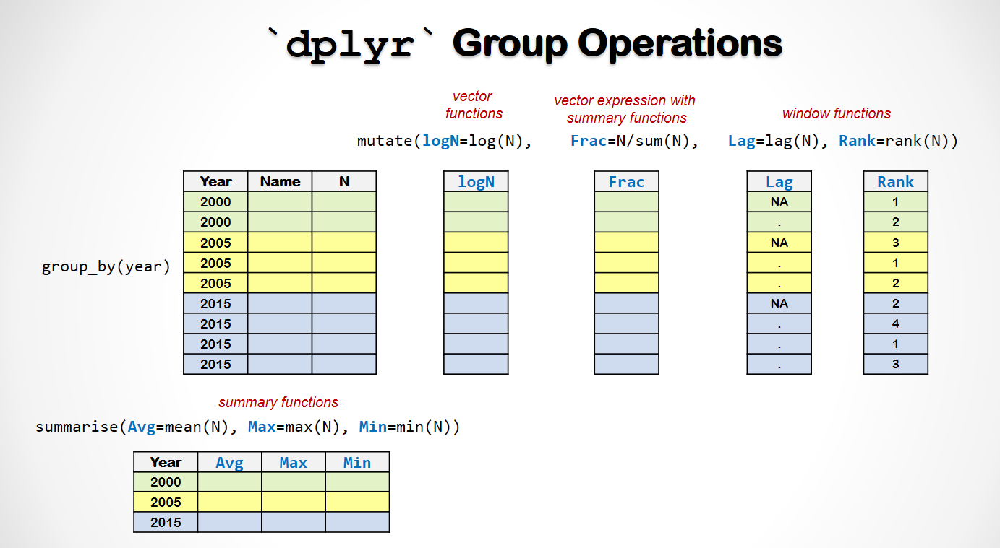

```{r echo=F, results='hide', message=FALSE, warning=FALSE}
# Installation, setup & formatting. Do not modify this code chunk.  
rm(list=ls(all=T))
knitr::opts_chunk$set(comment = NA)
knitr::opts_knit$set(global.par = TRUE)
par(cex=0.7) 
options(scipen=20, digits=4, width=80, tibble.print_min=4)
rmarkdown::find_pandoc(version = '2.7.3')
if(!require(pacman)) install.packages("pacman")
if(!require(dplyr)) install.packages("dplyr")
if(!require(tidyr)) install.packages("tidyr")
if(!require(ggplot2)) install.packages("ggplot2")
if(!require(plotly)) install.packages("plotly")
```

<br><br><p class="wwl"><span style='font-size:24px'> 🏠 </span>
<span style='font-size:14px; font-family:"Arial Black"'>
<b><u>學習重點 :</u></b></span><br>
對照 Datacamp 第四章： [Data Manipulation with dplyr](https://learn.datacamp.com/courses/data-manipulation-with-dplyr) <br>
&emsp; ■ `group` 在 dplyr 的作用<br>
&emsp; ■ `group_by()` ... `summarise()`  <br>
&emsp; ■ `group_by()` ... `mutate()`  <br>
&emsp; ■ 介紹三種不同的 R 功能 ... <br>
&emsp; &emsp; 。 **匯總**功能 (summary functions，例: `sum`, `mean`) 會將向量轉為單值 <br>
&emsp; &emsp; 。 **向量**功能 (vector functions，例: `sqrt`, `log`) 會將向量轉為等長的向量 <br>
&emsp; &emsp; 。 **窗口**功能 (window functions，例: `order`, `lag`) 會將向量轉為等長的向量 <z>但 ... </z><br>
&emsp; ■ 介紹 `ggplot2` : `dplyr` 的姐妹套件  <br>
</p class="wwl">

{width=600}

<br><br>


載入所需套件 & 讀取 babynames 資料集 
```{r message=FALSE, warning=FALSE}
pacman::p_load(dplyr,tidyr,ggplot2,babynames)
B = babynames
B
```

這是對美國出生嬰兒姓名的統計資料，搜集了1880年後每一年、每一個嬰兒名字的登記次數。是一個相當大的資料集，共有`1,924,665`筆紀錄與5個欄位 ...   

```{r}
str(B)
```

<br><br>

### 1. Group_By

🌻 `group_by()` 在資料框(tibbles)中標注群<z>組結構</z>(`Groups`)，
組結構本身不會改變資料，但會影響資料處理管線(`%>%`)之中後續功能的運作方式。

```{r}
B
group_by(B, year)

```
<br>

❓ 比較上面兩段程式，他們有什麼不一樣嗎？ 

<br>
```{r}
# Groups: year [138]  前者無分組後者有

```

<br>


### 2. Group Summaries

`group_by()` 指令後面最常接的函數為 `summarise()`. 
```{r}
group_by(B, year) %>% summarise(
  no_records = n(),               # 各年份的資料筆數
  no.names = n_distinct(name),    # 各年份出現幾種不同的名字
  no.baby = sum(n)                # 各年份的嬰兒數量 
  )
```

🌻 `group_by() %>% summarise()` : 由於`summarise()`之中只能用回傳單值的運算式來定義新變數
(通常是使用像`mean()`,`max()`,`n()`這一類的summary functions)，
所以執行完`summarise()`之後，每個組結構會被彙總成一筆資料，如此一來，這個群組結構就沒有用了，因此每一次執行完`summarise()`之後，資料框之中的最後一個組結構就會被移除。由於它只會自動移除最後一個組結構，所以如果你在`group_by()`裡面一次放很多個群組變數，`summarise()`之後資料框之中就會有一些殘留下來的組結構，假如你不再需要這一些結構，最好在資料處理管線之中用`ungroup()`或者在`summarise()`裡面用`.groups='drop'`將它們移除，以免造成錯誤或者拖慢管線執行的速度。

<br><br>


### 3. Group Mutate

Group mutate 比 group summarise 更有用，但要它用需要注意比較多的細節！

##### 3.1 純向量運算 (Pure Vector Operations)

🌻 在群組結構之中，`mutate()`裡面只允許使用會回傳跟群組資料等長向量的運算式 
 
🌷 但是如果運算式中只用到 vector functions 或者是數學運算符號，像這樣子單純的向量運算，並不需要用到群組結構，單純的向量運算在整個資料框執行會比較有效率；單純的向量運算直接在整個資料框做和在組結構裡面做的結果是一樣的，在組結構裡面做純向量運算會拖慢資料管線的運算速度，卻不能得到任何好處。

```{r}
B %>% group_by(name) %>% mutate(logN=log(n), sqrtN=sqrt(n))
```
這個Group Mutate會在每一個組結構裡面做一次運算，所以這一段程式總共會執行97,310 次，

但其結果卻和...
```{r}
B %>% mutate(logN=log(n), sqrtN=sqrt(n))
```
對整個tibble只做一次向量運算結果完全相同

🌷 所以，直覺上group mutate好像是兩相矛盾的 ...

+ 一方面，`mutate()`裡面只允許使用向量運算式
+ 另一方面，對純向量運算進行group mutate卻是沒有意義的
+ 然而，group mutate其實是非常有用的，我們將在下面提到它的正確使用方法

<br>


##### 3.2 使用Summary功能的向量運算式(Vector Expression)
實際上，在 `mutate()`中，除了向量函數之外，我們也可以使用向量運算式來定義新欄位，只要運算式所產生的向量長度與Group的長度相同就可以。 例如，我們有時候會想要將數值轉換成比例，例如，我們想知道某個名字在某年受歡迎的程度，我們應該要看的是該名字在當年度的佔比，而不是數量。 這個工作就可以透過一個向量運算式來完成，像在  ....
```{r}
group_by(B, year) %>% mutate(frac = 100*n/sum(n))
```
之中`sum()` 可以根據 `Groups: year [138]` 的結構，產生每一年所有`n`的總和。 以這個方式
，向量運算式就會對每一年的所有名稱做一次運算並產生每年每個名字的百分比

請注意，原始的資料集已經有一個 `prop` 的欄位 (column)，但這個欄位是按照年分和性別分開去計算的，因此`prop` 大約是 `frac` 的兩倍。

<br>

##### 3.3 Window 功能
Windows功能是向量功能中的一種特別的類型，就像一般的向量函數，它也會回傳一個和輸入相同長度的向量。 然而，大部分的向量功能的運算結果都不會被 `Groups`結構所影響，但是windows功能的運算結果卻會取決於`Groups`。 

Windows 功能大部分都和向量中元素的排列順序有關，例如：

+ `rank(v)`  產生一個基於`v`的值排序的索引向量,
+ `lag(v, n)`  將向量向前移動 `n` 個位置  
+ `lead(v, n)` 將向量向後移動 `n` 個位置  

舉一個實際的例子，如果我們想調查名字的流行度隨時間變化的速度，我們可以...
```{r}
B %>% group_by(sex, name) %>%              
  arrange(year) %>%                # 先將資料根據年份升冪排序
  mutate(                          # 然後使用lag來計算
    delta = 100 * (prop-lag(prop)) # 每年 prop 增加的百分比
    ) %>%                          # 
  arrange(desc(delta))             # 根據delta降冪排序
```
`prop` 欄位增加最多的是 1947 年女生的名字 Linda 

<br><br><br>


<center>
{height=80}
</center>

##### 忍者道場 . . . . .
讓我們用我們學到的東西應用在嬰兒姓名資料集上面，並且配合`ggplot2`和`plotly`套件做互動式的資料視覺化。

找出前20名的名字，並計算出他們的累計百分比
```{r}
count(B, sex, name, wt=n, sort=T) %>% 
  mutate(pc=n/sum(n), cumpc=cumsum(pc)) %>% 
  head(20)
```

將曾經是年度最受歡迎的女性名字都找出來，放在`fChamp`裡面。
```{r}
filter(B, sex=="F")  %>% 
  group_by(year) %>% top_n(1, n) %>% ungroup %>%  
  count(name, sort=T) -> fChamp
```

並將它們每一年的佔比用折線圖繪製在互動式的圖表中
```{r fig.height=3.5, fig.width=7}
gg = filter(B, sex=="F", name%in%fChamp$name) %>% 
  ggplot(aes(x=year, y=prop, color=name)) + geom_line() +
  labs(color="",title="最受歡迎的女生名字")
ggplotly(gg) %>% layout(legend=list(tracegroupgap=4))
```

對男生名字也做同樣的事情
```{r fig.height=3.5, fig.width=7}
filter(B, sex=="M")  %>% 
  group_by(year) %>% top_n(1, n) %>% ungroup %>%  
  count(name, sort=T) -> mChamp

gg = filter(B, sex=="M", name%in%mChamp$name) %>% 
  ggplot(aes(x=year, y=prop, color=name)) + geom_line()+
  labs(color="",title="最受歡迎的男生名字")
ggplotly(gg) %>% layout(legend=list(tracegroupgap=4))
```


🏄 這次忍者道場中我們可以學到兩件事......

+ `dplyr`的語法比較冗長，不過它比較有擴充性，也比較清楚。   
+ `dplyr`加上`ggplot`，可以用接水管的方式，透過很精緻的圖表，作互動式的資料探索。

<br><br><br><hr>

