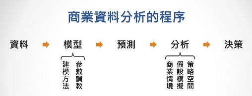

```{r}
options(shiny.usecairo = FALSE)
if(!require(shiny)) install.packages("shiny")
if(!require(shinyWidgets)) install.packages("shinyWidgets")
if(!require(flexdashboard)) install.packages("flexdashboard")
if(!require(ggplot2)) install.packages("ggplot2")
if(!require(dplyr)) install.packages("dplyr")
if(!require(plotly)) install.packages("plotly")
if(!require(pacman)) install.packages("pacman")
D = faithful$eruptions
```

**故事** {data-icon="fa-binoculars"}
=====================================

Row {data-height=250}
-------------------------------------
### ⏳  **老忠實噴泉** {data-width=75%}
<iframe width="100%" height="100%"  frameborder="0" src="https://www.youtube.com/embed/4mZY7uxb7Gc?start=6"  allowfullscreen></iframe>

### 🎏  **故事** {data-width=25%}
<div style="height:75%">
1870年9月18日下午，沃什布恩-蘭福德-多恩探險團從克卜勒瀑布沿火洞河進入上間歇泉盆地。他們第一個看到的間歇泉就是老忠實。在納撒尼爾·皮特·蘭福德1871年出版的探險記錄中，他寫道：“ ... 在第二天旅途的下午三點左右，我們進入了這個盆地、看到了清晰的陽光，最令我們驚奇的是在不遠處一個乾淨、密集而閃閃發光的水柱噴向了一百二十五英尺高空。「間歇泉！間歇泉！」我們的一個同伴叫道，踢打著身下倦怠的馬，我們聚集到了這奇境四周。這絕對是一個完美的間歇泉。水汽穿過孔穴形成一個不規則的橢圓，直徑三點七英尺，其中是帶著各種沉積物的小水珠。這個間歇泉高出它所在平原三十英尺，噴發口又高出五或六英尺。在我們呆在那裡的時候，它有規律地噴發了九次，沸水噴發的高度從九十至一百二十五英尺不等，每次持續約十五至二十分鐘。我們把它命名作「老忠實」” - Nathaniel P. Langford, 1871
</div>

<div style="height:25%">
<p> <br>
[大數據運算平台網站](https://bap2.cm.nsysu.edu.tw)<br>
<span style="font-size:11px;">國立中山大學 管理學院</span></p>
</div>


資料 {data-orientation=columns data-icon="fa-table"}
=====================================
Column {data-width=180}
-------------------------------------
### `data(faithful)`
<div style="font-size:90%; height:100%; overflow-y:auto;">
```{r}
renderTable({ faithful })
```
</div>

Column {data-width=270}
-------------------------------------
### 🌻 **Data** {data-height=25%}
這個內建資料集紀錄了272次老忠實間歇泉的噴發時間和等待時間；從以上這一些簡單的統計量，我們大致上可以知道數據分布的範圍；

### 🌻 **Statistics** : `summary(faithful)` {data-height=35%}
```{r}
summary(faithful)
```

### 🌻 **Chart** {data-height=20%}
我們可以用圖表幫助我們進一步了解數據的分佈情況； 

### 🌻 **Model** {data-height=20%}
但是圖表並不能幫我們做數值或機率的估計和預測，想要用數值的方法幫助我們做決策，我們需要使用模型。   .     

Column 
-------------------------------------
### 🌻 **Scatter Plot** {data-height=85%}
```{r}
mutate(faithful, type = ifelse(eruptions > 3, "Long", "Short")) %>% 
  ggplot(aes(waiting, eruptions, col=type)) +
    geom_point(alpha=0.5) +
    geom_smooth(method='lm', se=T) +                       
    geom_smooth(method='lm', se=F, col="gray", lty=2) +
    labs(x="Waiting Time",y="Eruption Time",col="",
         title="The Eruption Events") + 
    theme_bw() -> p
ggplotly(p) %>%  layout(legend = list(x = 0.05, y = 0.95))

#se=T:顯示平穩的置信區間                                  # geom_smooth:第一二條線順序?
```


模型預估 {data-orientation=rows data-icon="fa-cogs"}
=====================================

Row {data-height=75%}
-------------------------------------

### 📊 **數值分佈模型** {data-width=70%}
```{r}
txt = "A model is a mathematical representation of a variable.\nA distribution function is a model that describes how the value of a variable varies."

renderPlot({
  par(mar=c(4,4,2,1))
  plot(0,0,xlim=c(1.5,5.25),ylim=c(0,1.1),xlab="噴發時間(分鐘)", 
       ylab="機率密度", main="噴發時間分佈")
  abline(h=1, col='gray', lwd=0.5, lty=2)
  text(3.4, 1.13, txt, pos=1, col="navyblue", cex=1.2)

  bx = seq(min(D), max(D), length.out=input$W)
  adj = (bx[2] - bx[1])/2
  DEN = density(D, adjust = input$B)
  PDF = approxfun(DEN$x, DEN$y, yleft=0, yright=0)

  if(input$rug) rug(D)
  if(input$hist) hist(
    D,freq=F,col="#B3FFFF",border="white",
    ylim=c(0,1.1),add=T,breaks=bx)
  if(input$pdf) lines(DEN, col='gold', lwd=3)
  
  if(input$cdf.r) plot(ecdf(D), cex=0, verticals=T, add=T, lwd=2, col='darkgray')
  if(input$cdf.h) plot(
    stepfun(bx - adj, c(0, sapply(bx, function(b) mean(D <= b)))),
    cex=0, col='#33CC337F', lwd=3, add=T)
  if(input$cdf.d) {
    x = seq(1,6,0.1)
    abline(v=input$R, col='gold', lwd=0.5)
    lines(x, sapply(x, function(i) 
      integrate(PDF, -Inf, i)$value), col='red', lwd=3, lty=2) 
    x=c(input$R)
    y=c(integrate(PDF, -Inf, x[1])$value, integrate(PDF, -Inf, x[2])$value)
    points(x, y, col="orange", pch=16, cex=2)
    text(x, y, round(y,3), pos=3, cex=1.2)
    }

  x = seq(input$R[1], input$R[2], length=100)
  polygon(c(x, input$R[2], input$R[1]),  c(PDF(x), 0, 0), 
          col="#FF99003F", border=NA)
  abline(h=0, col='gray', lwd=0.5)

  })
```

### ⏱ **估計機率** {data-width=30%}
```{r}
chooseSliderSkin("Modern")

renderGauge({
  DEN = density(D, adjust = input$B)
  PDF = approxfun(DEN$x, DEN$y, yleft=0, yright=0)
  PROB = integrate(PDF, input$R[1], input$R[2])$value
  gauge(round(100*PROB,1), min = 0, max = 100, symbol = '%', gaugeSectors(
    success = c(41, 100), warning = c(21, 40), danger = c(0, 20)) )
  })
sliderInput("R", "Time Period", 1.4, 5.4, c(2.7,4.3), 0.1, width='350px')

```


Row {data-height=25%}
-------------------------------------
### 🚴 **機率密度函數(PDF)** {data-width=20%}
```{r}
checkboxInput("rug", "數值標記(Rugs)", T)
prettyCheckbox("hist", "直方圖(Histogram)", F, status="info", shape="curve")
prettyCheckbox("pdf", "平滑密度函數(Density Fun.)", T, status="warning", shape="curve")
```

### 🚴 **累計機率函數(CDF)** {data-width=20%}
```{r}
checkboxInput("cdf.r", "數值標記 CDF", F)
prettyCheckbox("cdf.h", "直方圖 CDF", F, status="success", shape="curve")
prettyCheckbox("cdf.d", "平滑密度函數 CDF", T, status="danger", shape="curve")
```

### 🚴 **調整模型複雜度** {data-width=30%}
```{r}
sliderInput("W", "Histogram, no. Bins", 10, 40, 20, 2, width='400px') 
sliderInput("B", "Density Func., Bandwidth", 0.3, 1.8, 1, 0.1, width='400px')
```

### 💡 **操作說明**  {data-width=30%}
<span style="font-size:24px"> 🦉 </span> : 
[Youtube影片連結](https://youtu.be/PsV0h3O0Gc4)
(ctrl + click)

<div style="height:25%">
<p> <br>
[大數據運算平台網站](https://bap2.cm.nsysu.edu.tw)<br>
<span style="font-size:11px;">國立中山大學 管理學院</span></p>
</div>


商業情境 {data-icon="fa-money"}
=====================================
### <span style="font-size:22px">`r "\U1F5FF"` 商業情境</span> {data-height=250}
<p class="qiz">
假如你是黃石公園的旅遊直昇機公司，你的業務需要預估老忠實下一次的噴發時間，假如現在的商業情境是：<br>
你可以花30元選定一個連續60秒的時段，如果老忠實下一次的噴發時間落在你指定的區間，你就可以贏到100元；<br>
請你使用頻寬為0.5的平滑密度模型 ... <br>
&emsp; ■ 決定要不要參加這個賭局<br>
&emsp; ■ 如果你參加的話，你要把噴發時間設定在哪一個區間呢？<br>
&emsp; ■ 你設在這個區間的話，參加這個賭局的淨期望報償是？<br>
<br>
假如商業情境變成：從零開始把每10秒鐘設為一個區間，每個區間的賭金是五塊錢 ...<br>
&emsp; ■ 你要怎麼押注，才能獲得最高的期望報償呢？<br>
&emsp; ■ 你的投資金額和期望報償各是多少？<br>
<br>
將期望報償和投資金額的比值稱為「期望投資報酬率」 ...<br>
&emsp; ■ 「最大期望投資報酬率」和「最大期望報酬」的投資策略是一樣的嗎？<br>
&emsp; ■ 你認為哪一個策略目標比較好呢？ 為什麼？<br>
<br>
</p class="qiz">


策略模擬 {data-orientation=columns data-icon="fa-chess-knight"}
=================================================================
Column {data-width=45%}
-------------------------------------
### 🌷 <b>模擬結果</b> {data-height=52%}
<div style="font-size:13px; height:98%; overflow-y:auto; font-family:'Consolas';">
```{r}
DEN = density(D, adjust=0.5)                # density function  
PDF = approxfun(DEN$x, DEN$y, yleft=0, yright=0)         # pdf
x = seq(1,6,1/6)                             # 10 second steps
cdf = sapply(x, function(i) integrate(PDF,-Inf,i)$value) # cdf
outcome = data.frame(
  start = x - 1/6, stop = x, 
  prob = cdf -lag(cdf) 
  ) %>% 
  mutate(payoff = 100*prob - 5) %>% 
  arrange(desc(payoff)) %>% 
  mutate(
    n_bets = row_number(),
    c_invest = n_bets * 5,
    c_payoff = cumsum(payoff),
    c_ROI = c_payoff/c_invest
  ) 
renderTable({ outcome })
```
</div>

### ⛓ <b>模型：機率密度函數</b> {data-height=10%}
<p style="font-family:'Consolas'; font-size:11px; 
color:#00c000; background:#000000;
border-left:12px solid #cce6ff; padding:4px; padding-left:10px;">
DEN = density(D, adjust=0.5) <br>
PDF = approxfun(DEN\$x, DEN\$y, yleft=0, yright=0) <br>
x = seq(1,6,1/6) <br>
cdf = sapply(x, function(i) integrate(PDF,-Inf,i)$value)<br> 
<br>
</p>

### ⛓ <b>資料管線：預估、情境、模擬</b> {data-height=38%}
<p style="font-family:'Consolas'; font-size:11px; 
color:#00c000; background:#000000;
border-left:12px solid #cce6ff; padding:4px; padding-left:10px;">
outcome = data.frame( <br>
&emsp; &emsp; start = x - 1/6, stop = x, <br> 
&emsp; &emsp; prob = cdf -lag(cdf) ) %>%  <br>
&emsp; mutate(payoff = 100 \* prob - 5) %>%  <br>
&emsp; arrange(desc(payoff)) %>%  <br>
&emsp; mutate( <br>
&emsp; &emsp; n_bets = row_number(), <br>
&emsp; &emsp; c_invest = cumsum(n_bets * 5), <br>
&emsp; &emsp; c_payoff = cumsum(payoff), <br>
&emsp; &emsp; c_ROI = c_payoff/c_invest) <br>
<br>
</p>

Column {data-width=55%}
-------------------------------------
### 🎲 <b>策略空間</b>  {data-height=60%}
```{r}
renderPlot({
  ggplot(outcome[1:20,], aes(c_ROI, c_payoff, color=c_invest)) + 
    geom_point(size=5) + 
    geom_text(aes(label=n_bets), color='black', nudge_y=1,size=4.5) +
    scale_color_gradientn(colors=c('seagreen','gold','gold','orange','red','darkred')) +
    labs(color="投資金額",y="預期報償",x="預期投報率")
  })
```

### {data-height=40%}

<p class="wwl">
<span style="font-size:14px">`r "\U1F36D"` <b>策略空間：</b></span><br>
&emsp; ■ 每一點是一個<z>策略</z>、坐標軸則是<z>績效指標</z> <br>
&emsp; ■ 在<z>效率前緣</z>上面的才是<z>合理策略</z> <br>
</p class="wwl">

<p class="wwl">
<span style="font-size:14px">`r "\U1F36D"` <b>策略限制與權衡：</b></span><br>
&emsp; ■ 如果沒有其它的投資機會，也沒有資金的限制，最佳的策略應該是？<br>
&emsp; ■ 如果你的資金上限是`c_invest < 40`呢？<br>
&emsp; ■ 如果你有另外一個`ROI = 62.5%`的投資機會呢？<br>
</p class="wwl">


學習重點 {data-icon="fa-lightbulb"}
=====================================
Row 1 
-------------------------------------
<p class="wwl">
<span style="font-size:20px">`r "\U1F36D"` 學習重點：</span><br>
■ 資料分析的基礎：資料、統計量、圖形、模型 <br>
■ 建立模型的步驟：模型形式、複雜度參數 <br>
■ 模型是一種幫助我們在不確定下做決策的工具，有模型才能做量化的預測和估計 <br>
■ 但是，預測並不等於決策，模型做完，商業分析才剛開始而已 <br>
■ 商業分析的步驟： <br>
&emsp; &emsp; ◇ 資料、模型 <br>
&emsp; &emsp; ◇ 條件、預測、模擬、策略目標 <br>
&emsp; &emsp; ◇ 策略目標視覺化、溝通、決策 <br>
■ R語言可以串聯上述步驟，用資料裝配線來進行商業分析 <br>
■ 決策是一個溝通的過程，視覺化提供一個溝通的基礎 <br>
</p class="wwl">

Row 2 
-------------------------------------


