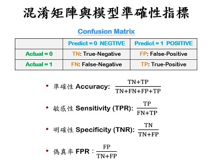

```{r results='hide', message=FALSE, warning=FALSE, echo=F}
# Formating Codes.  Do not change the codes in this chunk !!
# rm(list=ls(all=T))
knitr::opts_chunk$set(comment = NA)
knitr::opts_knit$set(global.par = TRUE)
par(cex=0.8)
options(scipen=20, digits=5, width=80)
if(!require(pacman)) install.packages("pacman")
```
<hr>

**案例：糖尿病患醫療品質**
```{r results='hide', message=FALSE, warning=FALSE}
pacman::p_load(caTools, ggplot2, dplyr)

D = read.csv("data/quality.csv")  # Read in dataset

set.seed(88)
split = sample.split(D$PoorCare, SplitRatio = 0.75)  # split vector
TR = subset(D, split == TRUE)
TS = subset(D, split == FALSE)
glm1 = glm(PoorCare ~ OfficeVisits + Narcotics, TR, family=binomial)
summary(glm1)

```
<br><hr>


### 【A】傳統準確性指標



<br>

##### Training Data

**預測機率 Predicted Probability (Training)**
```{r fig.height=3.2, fig.width=6.4}
par(cex=0.8)
pred = predict(glm1, type="response")  # type="response":預測機率
hist(pred)
abline(v=0.5, col='red')

```

**混淆矩陣 Confusion Matrix (Training)**
```{r}
cmx = table(Acture=TR$PoorCare, Predict=pred > 0.5)  # threshold = 0.5
cmx
```

**模型準確性指標 Accuracy Metrices (Training)**
```{r}
AccuracyMetrices = function(x, k=3) c(
  accuracy = sum(diag(x))/sum(x),                    # 準確性
  sensitivity = as.numeric(x[2,2]/rowSums(x)[2]),    # 敏感性 TP/(FN+TP)
  specificity = as.numeric(x[1,1]/rowSums(x)[1])     # 明確性 TN/(TN+FP)
  ) %>% round(k)
AccuracyMetrices(cmx)
```
<br>

##### Testing Data

**預測機率 Predicted Probability (Testing)**
```{r fig.height=3.2, fig.width=6.4}
par(cex=0.8)
pred2 = predict(glm1, newdata=TS, type="response")
hist(pred2, 10)
abline(v=0.5, col='red')

# predict(object,...) ... 類似 **kwargs，影響產生的預測的其他論據

```

**混淆矩陣 Confusion Matrix (Testing)**
```{r}
cmx2 = table(Acture=TS$PoorCare, Predict=pred2 > 0.5)  # threshold = 0.5
cmx2
```

**比較模型準確性指標 Accuracy Matrices (Testing)**
```{r}
sapply(list(Train=cmx, Test=cmx2), AccuracyMetrices)
```
<br><br><hr>

### 【B】預測機率分佈、臨界機率、混淆矩陣


<br>

**分類預測機率分佈 (cDPP) - Categorical Dist. of Predicted Prob. (Train)**
```{r fig.height=3.2, fig.width=7}
data.frame(y=factor(TR$PoorCare), pred=pred) %>% 
  ggplot(aes(x=pred, fill=y)) + 
  geom_histogram(bins=20, col='white', position="stack", alpha=0.5) +
  ggtitle("Distribution of Predicted Probability (DPP,Train)") +
  xlab("predicted probability")

# 不轉 factor 會變連續數字 0 1 就不能用 fill 填顏色

```
<br>

**分類預測機率分佈 (cDPP) - Categorical Dist. of Predicted Prob. (Test)**
```{r fig.height=3.2, fig.width=7}
data.frame(y=factor(TS$PoorCare), pred=pred2) %>%     # TS,pred2:Testing
  ggplot(aes(x=pred, fill=y)) + 
  geom_histogram(bins=20, col='black', position="stack", alpha=0.5) +
  ggtitle("Distribution of Predicted Probability (DPP,Test)") +
  xlab("predicted probability")

# 通常不會把畫 Test 出來

```

<br><br><br><hr>

### 【C】作業曲線(ROC)與辨識率(AUC)

**ROC - Receiver Operation Curve**
```{r fig.height=4, fig.width=7.2}
par(mfrow=c(1,2), cex=0.8)
trAUC = colAUC(pred, y=TR$PoorCare, plotROC=T)  # plotROC=T 沒這個就只會給數字
tsAUC = colAUC(pred2, y=TS$PoorCare, plotROC=T)
```

**AUC - Area Under Curve**
```{r}
c(trAUC, tsAUC)  # 曲線下面積
```
<br><hr>

<p class="qiz">
<span style="font-size:24px">`r "\U1F5FF"` 練習： </span><br>
使用`TR$MemberID`以外的所有欄位，建立一個邏輯式回歸模型來預測`PoorCare`，並：<br>
&emsp; 【A】 分別畫出`Training`和`Testing`的`DPP`<br>
&emsp; 【B】 分別畫出`Training`和`Testing`的`ROC`<br>
&emsp; 【C】 分別算出`Training`和`Testing`的`ACC`、`SENS`和`SPEC`<br>
&emsp; 【D】 分別算出`Training`和`Testing`的`AUC`<br>
&emsp; 【E】 跟用兩個預測變數的模型相比，這一個模型有比較準嗎？<br>
&emsp; 【F】 為什麼它比較準(或比較不準)呢？<br><br>
</p class="qiz">

```{r}
# 使用`TR$MemberID`以外的所有欄位，建立一個邏輯式回歸模型來預測`PoorCare`

set.seed(88)
split = sample.split(D$PoorCare, SplitRatio = 0.75)  # split vector
TR = subset(D, split == TRUE)
TS = subset(D, split == FALSE)

glm2 = glm(PoorCare ~ . - MemberID, TR, family=binomial)
# glm2 = glm(PoorCare ~ ., TR[,-c(1,8)], family=binomial)
# c(8)，TotalVisits : 全是 NA，因為他跟其他變數有線性關係
summary(glm2)

```

**預測機率 Predicted Probability (Training)**
```{r fig.height=3.2, fig.width=6.4, results='hide', message=FALSE, warning=FALSE, echo=F}
par(cex=0.8)
pred_ = predict(glm2, type="response")  # type="response":預測機率
hist(pred_)
abline(v=0.5, col='red')

```

**預測機率 Predicted Probability (Testing)**
```{r fig.height=3.2, fig.width=6.4, results='hide', message=FALSE, warning=FALSE, echo=F}
par(cex=0.8)
pred2_ = predict(glm2, newdata=TS, type="response")
hist(pred2_, 10)
abline(v=0.5, col='red')

# predict(object,...) ... 類似 **kwargs，影響產生的預測的其他論據

```


**分類預測機率分佈 (cDPP) - Categorical Dist. of Predicted Prob. (Train)**
```{r fig.height=3.2, fig.width=7}
# 【A】 分別畫出Training和Testing的DPP

data.frame(y=factor(TR$PoorCare), pred=pred_) %>% 
  ggplot(aes(x=pred, fill=y)) + 
  geom_histogram(bins=20, col='white', position="stack", alpha=0.5) +
  ggtitle("Distribution of Predicted Probability (DPP,Train)") +
  xlab("predicted probability")

# 不轉 factor 會變連續數字 0 1 就不能用 fill 填顏色

```

<br>

**分類預測機率分佈 (cDPP) - Categorical Dist. of Predicted Prob. (Test)**
```{r fig.height=3.2, fig.width=7}
data.frame(y=factor(TS$PoorCare), pred=pred2_) %>%     # TS,pred2:Testing
  ggplot(aes(x=pred, fill=y)) + 
  geom_histogram(bins=20, col='black', position="stack", alpha=0.5) +
  ggtitle("Distribution of Predicted Probability (DPP,Test)") +
  xlab("predicted probability")

# 通常不會把畫 Test 出來

```

**ROC - Receiver Operation Curve**
```{r fig.height=4, fig.width=7.2}
# 【B】 分別畫出Training和Testing的ROC

par(mfrow=c(1,2), cex=0.8)
trAUC_ = colAUC(pred_, y=TR$PoorCare, plotROC=T)  # plotROC=T 沒這個就只會給數字
tsAUC_ = colAUC(pred2_, y=TS$PoorCare, plotROC=T)
```

```{r , results='hide', message=FALSE, warning=FALSE, echo=F}
# **模型準確性指標 Accuracy Metrices **

AccuracyMetrices = function(x, k=3) c(
  accuracy = sum(diag(x))/sum(x),                    # 準確性
  sensitivity = as.numeric(x[2,2]/rowSums(x)[2]),    # 敏感性 TP/(FN+TP)
  specificity = as.numeric(x[1,1]/rowSums(x)[1])     # 明確性 TN/(TN+FP)
  ) %>% round(k)
AccuracyMetrices(cmx)
```

```{r,echo=T}

# **混淆矩陣 Confusion Matrix (Training)**
cmx_ = table(Acture=TR$PoorCare, Predict=pred_ > 0.5)    # threshold = 0.5
cmx_

# **混淆矩陣 Confusion Matrix (Testing)**
cmx2_ = table(Acture=TS$PoorCare, Predict=pred2_ > 0.5)  # threshold = 0.5
cmx2_

```


**比較模型準確性指標 Accuracy Matrices**
```{r}
# 【C】 分別算出 Training 和 Testing 的 ACC、SENS 和 SPEC

# threshold = 0.5

sapply(list(Train=cmx_, Test=cmx2_), AccuracyMetrices)

```

**AUC - Area Under Curve**
```{r}
# 【D】 分別算出Training和Testing的AUC

c(trAUC_, tsAUC_)  # 曲線下面積

```

```{r}
# 【E】 跟用兩個預測變數的模型相比，這一個模型有比較準嗎？

# 以AIC值越小，模型配適度越佳的角度來看
# 原:AIC: 95.13 & 新:AIC: 96.53
# 原模型較佳

# 以 ACC、SENS 和 SPEC 來看，兩個模型都差不多
# sensitivity 新模型好一點

# 以 AUC 來看
# 原:0.77459 0.79948 & 新:0.87568 0.86458
# 新模型較佳

# 總結:不一定

```

```{r}
# 【F】 為什麼它比較準(或比較不準)呢？

# 取決於重視何種指標
# 準或不準也可能取決於變數挑的好不好、有沒有意義

```

<br><br><br><hr>
