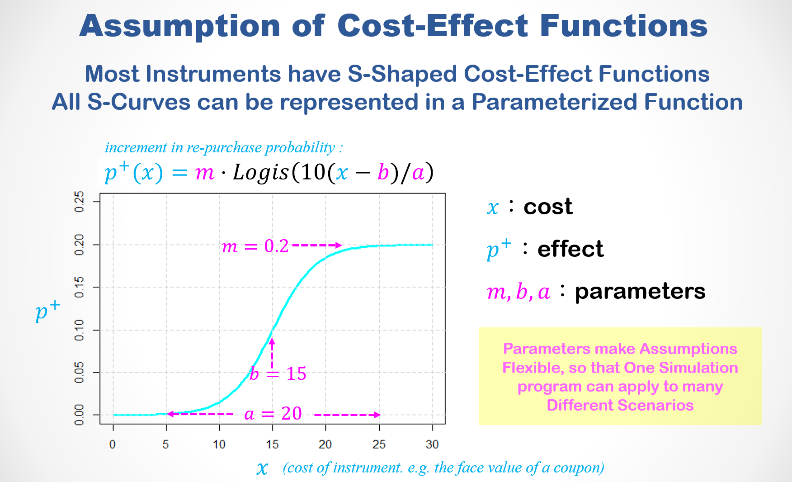

<br>

##### 載入資料
```{r echo=T, message=F, cache=F, warning=F}
options(scipen=10)
pacman::p_load(latex2exp,Matrix,dplyr,tidyr,ggplot2,caTools,plotly)
# rm(list=ls(all=TRUE))
load("data/tf4.rdata")
```

<br>

### A.使用模型做預測

+ `B$Buy` : 預期再購機率 Re-Purchase Probability
+ `B$Rev` : 預期購買金額 Expected Revenue Contribution

```{r fig.height=2.4, fig.width=7.2}
par(mfrow=c(1,2), cex=0.8)
hist(B$Buy)
hist(log(B$Rev,10))
```

```{r}
group_by(B,age) %>% 
  summarise(n=n(), Buy=mean(Buy), Rev=mean(Rev)) %>% 
  ggplot(aes(Buy,Rev,size=n,label=age)) + 
  geom_point(alpha=0.5,color='gold') + 
  geom_text(size=4) + 
  labs(title="Age Group Statistics (size: no. customers)") +
  scale_size(range=c(4,20)) + theme_bw()  -> p
ggplotly(p)
```
<br><hr>

### B.帶參數的假設

##### § S曲線 (S-Curve)


🌻 <z>S-Curve</z> : 許多管理工具都呈現S型的成本效益函數 

🌻 我們可以用R內建的邏輯式函數(`plogis()`)來模擬S曲線
$$\Delta P(x|m,b,a) = m \cdot Logis(\frac{10(x - b)}{a})$$
```{r fig.height=3}
DP = function(x,m0,b0,a0) {m0*plogis((10/a0)*(x-b0))}
par(mar=c(4,4,2,1),cex=0.7)
curve(DP(x,m=0.20,b=30,a=40), 0, 60, lwd=2, ylim=c(0, 0.25),
      main="F( x | m=0.2, b=30, a=40 )", ylab="delta P")
abline(h=seq(0,0.2,0.05),v=seq(0,60,5),col='lightgrey',lty=2)
```

<br>

##### § **帶參數**的成本效益函數 (S曲線)

🌻 <z>parameters(參數)</z>可以帶入彈性，放寬模擬的範圍



🌻 透過這3個<z>parameters(參數)</z>:

+ `m` : 最大效果 
+ `b` : 效果的位置(上升波段的中點)    
+ `a` : 效果的範圍(上升波段的寬度) 

我們可以寫『一支程式』來模擬『所有可能』的<z>成本效益函數</z>(S曲線)<br>
藉以描述<z>策略變數</z>($x$,折價卷面額)和<z>策略效果</z>($\Delta P$,購買機率增幅)之間的關係

<br>

##### § 估計預期獲利

有了行銷工具的成本效益函數之後，我們就可以估計將這個工具用在每一位顧客上的時候的預期效益:

$$\hat{R}(x) = \left\{\begin{matrix}
\Delta P \cdot M \cdot margin - x & , & P + \Delta P \leq 1\\ 
(1-P) \cdot M \cdot margin - x & , & else 
\end{matrix}\right.$$

🌻 結合  ...

+ 預測 ($P, M$) : 每位顧客的預期購買機率和購買金額，與
+ 假設 ($\Delta P(x|m,b,a)$) : 行銷工具帶來的再購機率增額

我們就可以估計這個工具用在每位顧客上的預期效益 $\hat{R}(x)$。 


🌻 Note that both $\Delta P$ and $\hat{R}$ are functions of $x$ given $m,b,a$

+ $P, M$ 預期購買機率和金額，是<z>預測</z>
+ $m, b, a$ 行銷工具的屬性，是<z>假設</z>
+ $x$ 行銷強度，是我們可以操作的、想要優化的<z>策略變數</z>

<br>

**估計毛利率** $m$
```{r}
# load(data/tf0.rdata)
# group_by(Z0, age) %>% summarise(sum(price)/sum(cost) - 1)
margin = 0.17  # assume margin = 0.17
```

**估計每位顧客的淨收益** $\hat{R}(x)$
```{r fig.height=3}
m=0.2; b=25; a=40; x=30
dp = pmin(1-B$Buy, DP(x,m,b,a))   # 1 - p : 調整過的，機率不能超過 1 & delta p 
eR = dp*B$Rev*margin - x
hist(eR,main="預期淨收益分佈",xlab="預期淨收益",ylab="顧客人數")
```

<br>

##### § 小組練習

根據以上的分析結果 ...

🚴 有多少顧客的預期報償大於零？ (`eR > 0`)?
```{r}
sum(eR>0) # 6679
```

🚴 如果我們針對所有顧客做促銷，預期報償將是？
```{r}
sum(eR) # -202435
```

🚴 如果我們針對預期報償大於零的顧客做促銷，預期報償將是？
```{r}
sum(eR[ eR>0 ]) # 80359
```

🚴 如果我們只針對預期報償大於10的顧客做促銷，預期報償將是？
```{r}
sum(eR[ eR>10 ]) # 63812
```

🚴 如果我們只針對預期報償大於10的南港(`z115`)顧客做促銷，預期報償將是？
```{r}
sum(eR[ eR>10 & B$area=="z115"   ]) # 12532

```


<br><hr>


### C.市場模擬

##### § 一個行銷工具

給定工具參數($m,b,a$)，我們可在其有效成本範圍($x \in [b-\frac{a}{2}, b+\frac{a}{2}]$)之內，估計工具的效果：

+ `eReturn` : 對所有的人行銷的總預期收益
+ `N` : 預期收益大於零的人數
+ `eReturn2` : 只對期收益大於零的人做行銷的總預期收益

如何隨成本變化。

```{r}
m=0.2; b=25; a=40; X = seq(10,45,1)

df = sapply(X, function(x) {
  dp = pmin(DP(x,m,b,a),1-B$Buy)
  eR = dp*B$Rev*margin - x
  c(x=x, eReturn=sum(eR), N=sum(eR > 0), eReturn2=sum(eR[eR > 0]))
  }) %>% t %>% data.frame  

df %>% gather('key','value',-x) %>% 
  ggplot(aes(x=x, y=value, col=key)) + 
  geom_hline(yintercept=0,linetype='dashed') +
  geom_line(size=1.5,alpha=0.5) + 
  facet_wrap(~key,ncol=1,scales='free_y') + theme_bw()

# gather : 以 x 為主，轉 df 表格
# scales='free_y' : 根據每個面板中的數據來縮放 y 軸範圍

# gather()
# 第一个参数放的是原数据，数据类型要是一个数据框
# 下面传一个键值对，名字是自己起的，这两个值是做新转换成的二维表的表头，即两个变量名
# 第四个是选中要转置的列，这个参数不写的话就默认全部转置
# 后面还可以加可选参数 na.rm，如果na.rm = TRUE，那么将会在新表中去除原表中的缺失值(NA)

# https://blog.csdn.net/six66667/article/details/84888644
# 结果:行列转换过来了，第一个参数是原数据stu，二、三两个参数是键值对（性别，人数），第四个表示减去（除去grade列，就只转置剩下两列）

```

##### § 多個行銷工具

With some modification (修改) of the code, we can define multiple (4) instruments (工具)

```{r fig.height=3, fig.width=7}
# 先來張 4 個模型的 S 曲線

mm=c(0.20, 0.25, 0.15, 0.25)
bb=c(  25,   30,   15,   30)
aa=c(  40,   40,   30,   60) 

X = seq(0,60,2) 
do.call(rbind, lapply(1:length(mm), function(i) data.frame(
  Inst=paste0('Inst',i), Cost=X, 
  Gain=DP(X,mm[i],bb[i],aa[i])
  ))) %>% data.frame %>% 
  ggplot(aes(x=Cost, y=Gain, col=Inst)) +
  geom_line(size=1.5,alpha=0.5) + theme_bw() +
  ggtitle("Prob. Function: f(x|m,b,a)")

```

and run simulation (模擬) on multiple instrument to compare their cost effectiveness (效益). 

```{r warning=F, fig.height=8, fig.width=8}

X = seq(10, 60, 1)  # 成本範圍

# 這裡有 4 個模擬器，分別看
# eReturn : 對所有的人行銷的總預期收益
# eReturn2 : 只對期收益大於零的人做行銷的總預期收益
# N : 預期收益大於零的人數
# 再用 lapply rbind 4 個模擬器

df = do.call(rbind, lapply(1:length(mm), function(i) {
  sapply(X, function(x) {
    dp = pmin(1-B$Buy, DP(x,mm[i],bb[i],aa[i]))
    eR = dp*B$Rev*margin - x
    c(i=i, x=x, eR.ALL=sum(eR), N=sum(eR>0), eR.SEL=sum(eR[eR > 0]) )
    }) %>% t %>% data.frame
  })) 

# vars :選擇變量 == select()

df %>% 
  mutate_at(vars(eR.ALL, eR.SEL), function(y) round(y/1000)) %>% 
  gather('key','value',-i,-x) %>% 
  mutate(Instrument = paste0('I',i)) %>%
  ggplot(aes(x=x, y=value, col=Instrument)) + 
  geom_hline(yintercept=0, linetype='dashed', col='blue') +
  geom_line(size=1.5,alpha=0.5) + 
  xlab('工具選項(成本)') + ylab('預期收益($K)') + 
  ggtitle('行銷工具優化','假設行銷工具的效果是其成本的函數') +
    facet_wrap(~key,ncol=1,scales='free_y') + theme_bw() -> p

plotly::ggplotly(p)

# eR.ALL=sum(eR)，全做通常都會虧本
# eR.SEL : 挑正的做 : I2，預期淨收益最大，落在成本 40 處
# 預期(淨)營收 : 147 K (146568) 
# N : 40元時，可對 8344 個人做

```

```{r}

# 利用這行指令，抓出所有模擬器的最佳解 : eR.SEL 最大 (挑正的做)
group_by(df, i) %>% top_n(1,eR.SEL)
```

🚴 從模擬的結果我們可以很容易看出每一個工具的：

+ 最佳行銷強度
+ 最佳行銷對象人數
+ 最佳預期獲利

<br><hr>


### D.討論
先看一下啊每一個年齡族群的顧客人數 ...
```{r fig.height=1.5, fig.width=5}
par(cex=0.7, mar=c(2,2,1,2))
table(B$age) %>% barplot
```
<br>

<p class="qiz">
<span style="font-size:18px"> 🚴 討論：</span><br>
如果上述4組工具參數分別是某折價券對4個不同年齡族群的效果：<br>
&emsp; ■  I1 : a24, a29 <br>
&emsp; ■  I2 : a34, a39 <br>
&emsp; ■  I3 : a44, a49 <br>
&emsp; ■  I4 : a54, a59, a64, a69 <br>
如果你可以在這4個年齡族群之中選擇行銷對象，你應該如何：<br>
&emsp; ■ 選擇行銷對象(`N`)？<br>
&emsp; ■ 設定折價券的面額(`x`)？<br>
&emsp; ■ 估計預期報償(`eR.SEL`)？<br>
&emsp; ■ I1 :面額:34；對560人做；預期報償:6472<br>
&emsp; ■ I2 :面額:40；對4083人做；預期報償:74282<br>
&emsp; ■ I3 :面額:22；對3131人做；預期報償:34746<br>
&emsp; ■ I4 :面額:43；對643人做；預期報償:9403
</p class="qiz"><br>

<br>

```{r}

# 分別挑出4個不同年齡族群
ci = sapply(
  list(c("a24","a29"),c("a34","a39"),
       c("a44","a49"),c("a54","a59","a64","a69")), 
  function(v) B$age %in% v)  

X = seq(10, 60, 1) 
df = do.call(rbind, lapply(1:length(mm), function(i) {
  sapply(X, function(x) {
    dp = pmin(1- B$Buy[ ci[,i] ]  , DP(x,mm[i],bb[i],aa[i]))
    eR = dp* B$Rev[ ci[,i] ]  *margin - x
    c(i=i, x=x, eR.ALL=sum(eR), N=sum(eR>0), eR.SEL=sum(eR[eR > 0]) )
    }) %>% t %>% data.frame
  })) 

group_by(df, i) %>% top_n(1,eR.SEL)

```

<br><br><hr>
